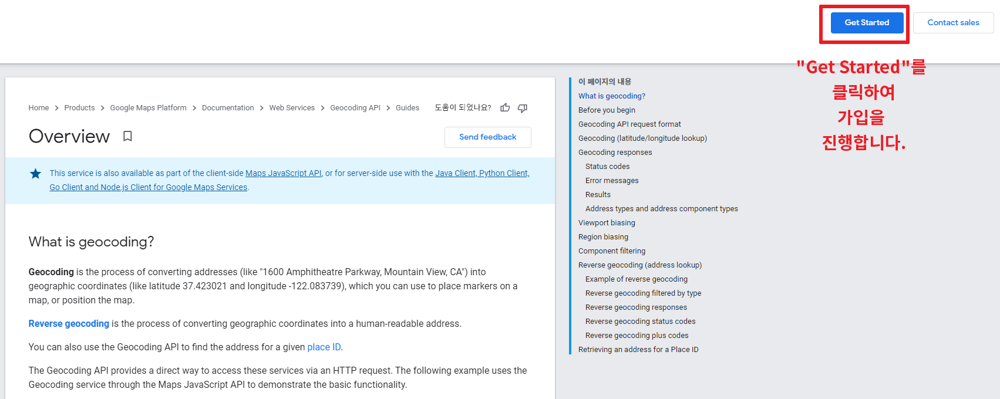
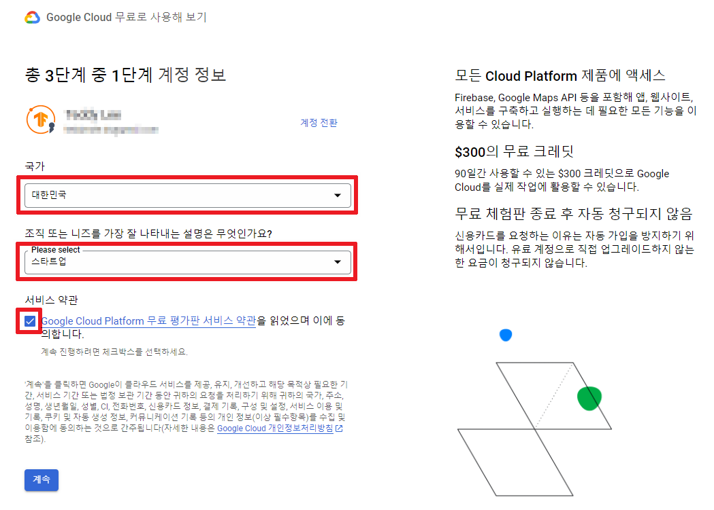
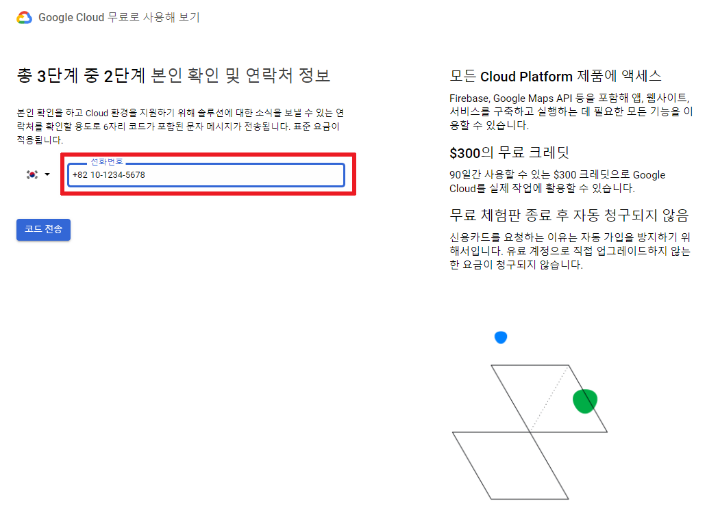
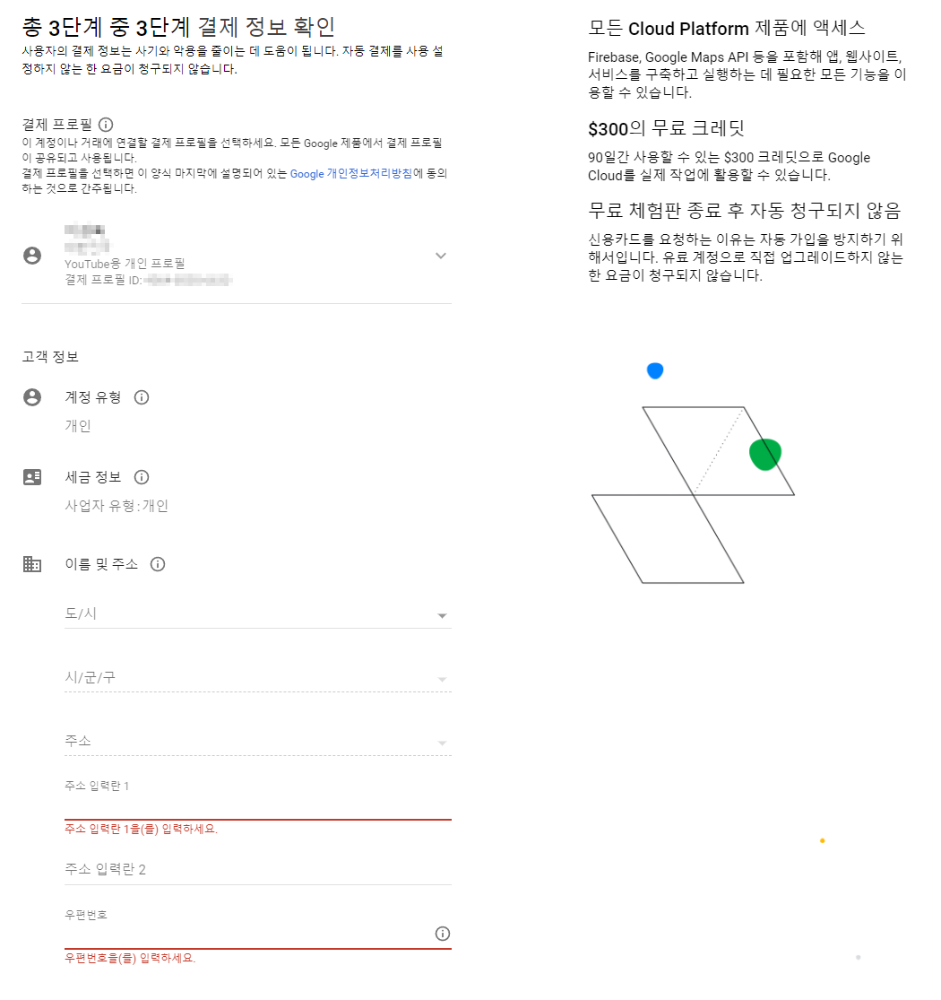
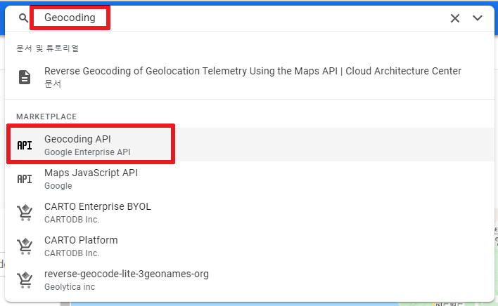
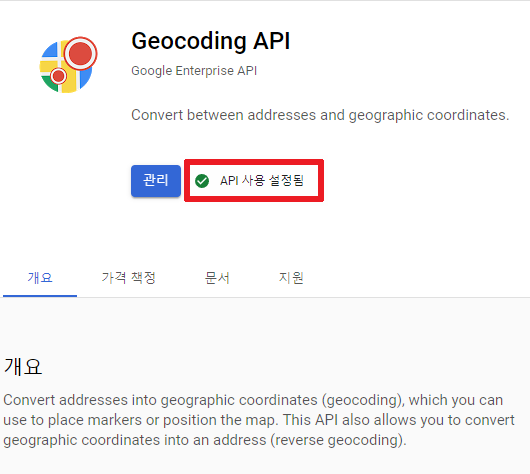

Google Cloud API 의 **Geocoding API**를 활용하여 **한글 주소를 위/경도 좌표계로 변경**해 보는 방법에 대하여 알아보겠습니다.

먼저, `Geocoding API`를 사용하여 위/경도 좌표를 받아야 하는데 `Geocoding API`의 사용을 위해서는 먼저 **Google Cloud API**에 무료 가입하고 **API 키를 발급**받아야 합니다.


## Google Cloud API 무료 가입 및 API 키 발급 (3분 미만 소요)

먼저, 다음의 [링크](https://developers.google.com/maps/documentation/geocoding/overview?hl=ko)를 클릭한 후 "Get Started"를 클릭합니다.




> 약관에 동의 후 "계속" 클릭




> 본인 휴대전화번호를 기입하여 인증합니다.




> 결제 정보를 입력해야 다음 단계로 넘어 갈 수 있습니다. (결제는 되지 않습니다)




> 마지막 설문을 완료하면 API 키가 발급됩니다.


> 발급된 API키를 외부에 노출하지 않도록 조심하세요! API키는 잘 복사해 둡니다.


**데모 빌드**를 "클릭"하여 종료 후 첫 프로젝트를 시작합니다.


상단의 검색 창에 **"Geocoding"**이라고 입력 후 `Geocoding API`를 클릭합니다.





`Geocoding API`가 사용 설정됨 을 확인 합니다. 이러면, API를 사용할 준비가 완료 되었습니다.





자 그러면, 발급한 API 키로 `googlemaps` 패키지를 설치하여 **지도의 주소 정보를 위/경도로 변환**해 보도록 하겠습니다.


## `googlemaps` 패키지 설치

`pip`으로 `googlemaps` 패키지를 설치할 수 있습니다.

```bash
!pip install googlemaps
```


## `googlemaps`로 지도 정보 조회

`api_key`에는 Google Cloud API에서 발급받은 API KEY를 입력합니다.

```python
import googlemaps

api_key = '구글클라우드API 키를 입력'
maps = googlemaps.Client(key=api_key)

# 위치 정보 입력
results = maps.geocode('판교역')
results
```

> 출력 (json)

```
[{'address_components': [{'long_name': 'Pangyo Station',
    'short_name': 'Pangyo Station',
    'types': ['establishment',
     'point_of_interest',
     'subway_station',
     'transit_station']},
   {'long_name': '160', 'short_name': '160', 'types': ['premise']},
   {'long_name': 'Pangyoyeok-ro',
    'short_name': 'Pangyoyeok-ro',
    'types': ['political', 'sublocality', 'sublocality_level_4']},
   {'long_name': 'Sampyeong-dong',
    'short_name': 'Sampyeong-dong',
    'types': ['political', 'sublocality', 'sublocality_level_2']},
   {'long_name': 'Bundang-gu',
    'short_name': 'Bundang-gu',
    'types': ['political', 'sublocality', 'sublocality_level_1']},
   {'long_name': 'Seongnam-si',
    'short_name': 'Seongnam-si',
    'types': ['locality', 'political']},
   {'long_name': 'Gyeonggi-do',
    'short_name': 'Gyeonggi-do',
    'types': ['administrative_area_level_1', 'political']},
   {'long_name': 'South Korea',
    'short_name': 'KR',
    'types': ['country', 'political']},
   {'long_name': '463-400',
    'short_name': '463-400',
    'types': ['postal_code']}],
  'formatted_address': 'Pangyo Station, 160 Pangyoyeok-ro, Sampyeong-dong, Bundang-gu, Seongnam-si, Gyeonggi-do, South Korea',
  'geometry': {'location': {'lat': 37.394776, 'lng': 127.11116},
   'location_type': 'ROOFTOP',
   'viewport': {'northeast': {'lat': 37.3961249802915,
     'lng': 127.1125089802915},
    'southwest': {'lat': 37.3934270197085, 'lng': 127.1098110197085}}},
  'place_id': 'ChIJPylOEwlYezUROOYJvffQr4g',
  'plus_code': {'compound_code': '94V6+WF Seongnam-si, Gyeonggi-do, South Korea',
   'global_code': '8Q9994V6+WF'},
  'types': ['establishment',
   'point_of_interest',
   'subway_station',
   'transit_station']}]
```

위도, 경도 정보는 다음과 같이 조회할 수 있습니다.

```python
for result in results:
    print(result['geometry']['location'])
```

> 출력

```
{'lat': 37.394776, 'lng': 127.11116}
```


`maps.geocode()` 호출시 **지역 명칭**을 전달해도 되고, **주소**를 전달해도 됩니다.

```python
# 서울역 => 지역명칭을 전달한 경우
maps.geocode('서울역')
# 결과
# {'lat': 37.555946, 'lng': 126.972317}

# 서울역의 주소인 '서울특별시 중구 세종대로 지하 2'
maps.geocode('서울특별시 중구 세종대로 지하 2')
# 결과
{'lat': 37.5624945, 'lng': 126.9752957}
```

다만, 위/경도 좌표는 **지역 명칭**을 전달한 경우와 **주소**를 전달한 경우 **약간의 차이**는 있을 수 있습니다.


이번에 **서울 지하철역 주소에 대한 위/경도 좌표계**가 필요하여 변환하여 **CSV 파일**로 만들었습니다.

혹시 필요하신 분들은 [여기](https://www.dropbox.com/s/2xy6zhf54rg5coc/seoul_station_geocode.csv?dl=1)에서 다운로드 받을 수 있습니다.

